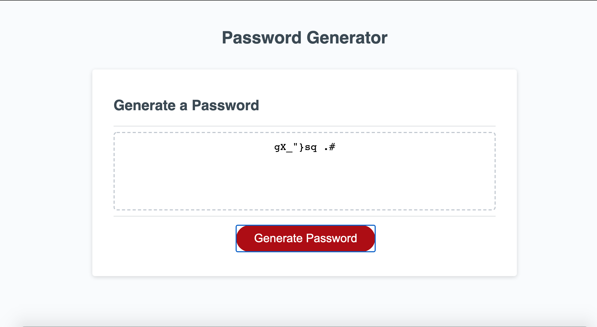
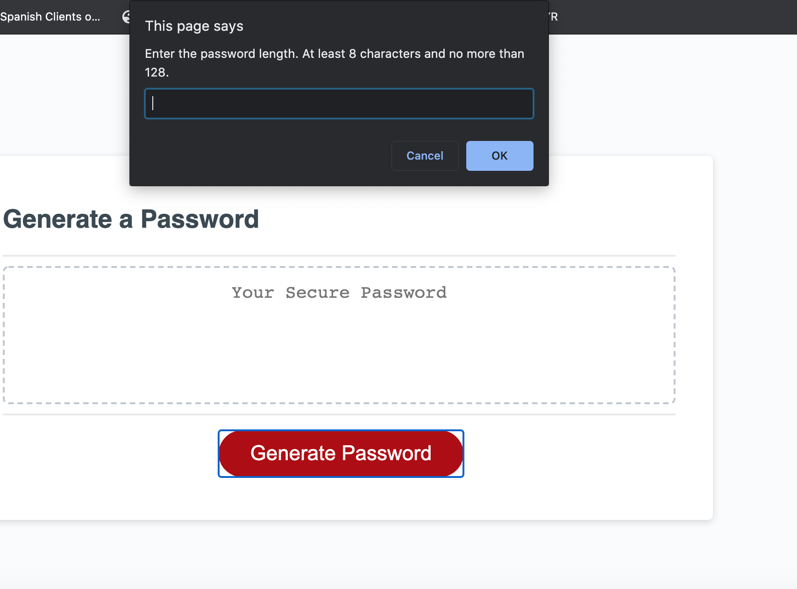
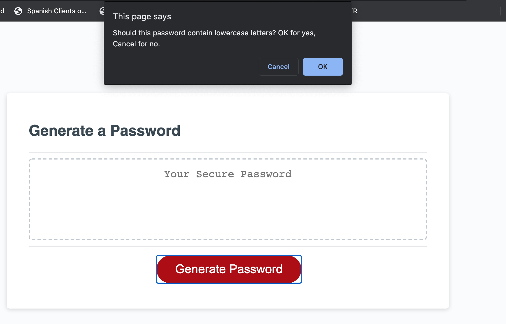

# Password Generator

Deployed URL: placeholder

Purpose: To create a password generator that asks for user input about password characteristics, and then creates the required password.

## Description

This application is a webpage that creates a random password that fits the user's specifications. The user is asked to choose the password length, and if the password should contain uppercase letters, lowercase letters, numbers, or special characters. From these characteristics a password is created and validated before it is displayed on the screen for the user.

## Visuals

Below are some examples of the look and function of this webpage.

